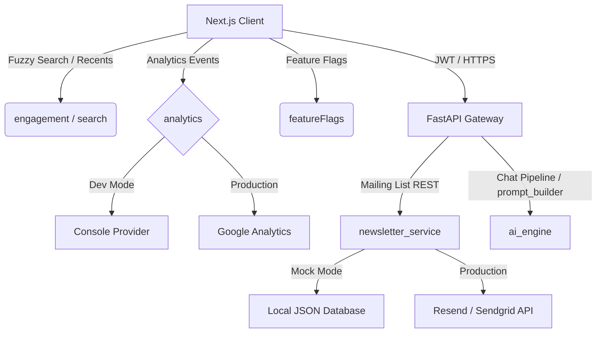

# AI Vedic Astrologer (₹0 Complete Deployment Guide)

Welcome to the **AI Vedic Astrologer** codebase. This is a fully modular, production-ready fullstack application consisting of a **FastAPI backend** (Python 3.12 + Google Gemini API) and a **Next.js frontend** client (TypeScript + TailwindCSS + Framer Motion).

This guide walks you through deploying the entire application on **100% Free Tiers** (Vercel/Cloudflare Pages, Render Free, and Gemini API Free) for a total monthly cost of **₹0** (no credit card required).


---

## Architecture Overview

```text
       [ Next.js Frontend ] (Hosted on Cloudflare Pages - Global CDN)
                │
                ▼ (Secure HTTPS calls /api/chat)
       [ FastAPI Backend ] (Hosted on Render Free Tier Web Service)
                │
                ▼ (Secure SSL API Request)
       [ Google Gemini LLM ] (Google AI Studio Free Tier API Key)
```

---

## Directory Structure

```text
D:\Astrologer\
├── .github/workflows/ci.yml   # Github Actions automated CI testing workflow
├── backend/                   # FastAPI backend python codebase
│   ├── app/                   # App source code (routes, services, schemas, middleware)
│   └── requirements.txt       # Backend dependencies
├── frontend/                  # Next.js App Router frontend codebase
│   ├── app/                   # Layouts, styles, and page routes
│   ├── components/            # UI components, layout headers, and chat elements
│   ├── public/                # Static assets & custom HTTP header configs
│   └── package.json           # Frontend dependencies
├── .env.example               # Combined environment variables template
├── .gitignore                 # Root git exclusions registry
├── LICENSE                    # MIT Open-source license
├── render.yaml                # Render Blueprint file for backend one-click configurations
└── README.md                  # This complete deployment guide
```

---

## Step-by-Step Deployment Guide

Follow these steps in sequence to set up the system in production:

### Step 1: Create a GitHub Repository
1. Log into [GitHub](https://github.com).
2. Create a new private or public repository named `ai-vedic-astrologer`.
3. In your local terminal, navigate to the root of this project and push the code:
   ```bash
   cd D:\Astrologer
   git init
   git add .
   git commit -m "Initial project commit"
   git branch -M main
   git remote add origin https://github.com/your-username/ai-vedic-astrologer.git
   git push -u origin main
   ```
*(Note: Root `.gitignore` automatically prevents your local `.env` and node cache files from being committed.)*

---

### Step 2: Deploy Backend to Render (Free Tier)
1. Go to the [Render Dashboard](https://dashboard.render.com/) and log in (using GitHub).
2. Click **New +** and select **Blueprint**.
3. Connect your `ai-vedic-astrologer` GitHub repository.
4. Render will parse the root-level `render.yaml` Blueprint file automatically.
5. In the configuration wizard, provide the required **Environment Variables**:
   - `GEMINI_API_KEY`: Generate a key from [Google AI Studio](https://aistudio.google.com/).
   - `ALLOWED_ORIGINS`: Set temporarily to `*` (we will restrict this in Step 4 once the frontend URL is generated).
   - `BACKEND_URL`: Leave blank for now.
6. Click **Approve**. Render will build and start your FastAPI server.
7. Once successfully deployed, note down your web service URL (e.g., `https://ai-vedic-astrologer-backend.onrender.com`).

---

### Step 3: Deploy Frontend to Cloudflare Pages (Free Tier)
1. Sign in to the [Cloudflare Dashboard](https://dash.cloudflare.com/) and navigate to **Workers & Pages**.
2. Click **Create** -> **Pages** -> **Connect to Git**.
3. Select your GitHub account and the `ai-vedic-astrologer` repository.
4. Configure the **Build Settings**:
   - **Project Name**: `ai-vedic-astrologer`
   - **Production Branch**: `main`
   - **Framework Preset**: `Next.js`
   - **Root Directory**: `frontend`
   - **Build Command**: `npm run build`
   - **Build Output Directory**: `.next`
5. Under **Environment Variables (Advanced)**, add:
   - `NEXT_PUBLIC_BACKEND_URL`: Set to the Render backend URL from Step 2 (e.g., `https://ai-vedic-astrologer-backend.onrender.com`).
6. Click **Save and Deploy**. Cloudflare will compile your Next.js application and serve it on a global CDN under a `*.pages.dev` subdomain.

---

### Step 4: Secure CORS Configurations
For security compliance, restrict the backend to accept requests only from your Cloudflare Pages domain.
1. Open the [Render Dashboard](https://dashboard.render.com/) and go to your backend web service.
2. Navigate to the **Environment** tab.
3. Update the following variables:
   - `ALLOWED_ORIGINS`: Set to your frontend URL (e.g., `https://ai-vedic-astrologer.pages.dev`).
   - `BACKEND_URL`: Set to the backend's own URL.
4. Save the changes. Render will automatically redeploy the service with restricted CORS protection.

---

## Verification & Validation

To ensure the deployment succeeded, verify:
1. **Frontend Assets**: Navigate to your `*.pages.dev` domain. Confirm the page loads rapidly and fonts render correctly.
2. **Backend Health Check**: Navigate to `https://<your-backend-url>/health`. Ensure the response returns `{"status": "healthy"}`.
3. **End-to-End Chat**: Start a chat, input birth parameters, and verify the AI Vedic Astrologer responds within 3-5 seconds.
4. **HTTPS Security**: Confirm both frontend and backend domains force secure HTTPS. Inspect the browser console to verify no mixed-content blocks occurred.

---

## Production Security & Optimizations

The application comes pre-configured with several production optimizations:
- **FastAPI GZip Compression**: Automatically compresses text and JSON replies over 1KB, decreasing latency.
- **Custom security headers**: Cloudflare Pages is pre-configured via the `_headers` file to output headers blocking frame clickjacking (`X-Frame-Options: DENY`) and cross-site scripting (`X-XSS-Protection`).
- **Anonymized Feedback**: Ratings and comments are stored in the backend in an isolated `feedback.json` format, preventing personal identifying details from leaking.

---

## Troubleshooting Common Errors

### 1. The backend throws `CRITICAL CONFIGURATION ERROR` on Render
* **Cause**: Render failed to load environment variables.
* **Fix**: Navigate to Render -> Web Service Settings -> Environment, and check if `GEMINI_API_KEY` and `ALLOWED_ORIGINS` have spelling mistakes or leading whitespaces.

### 2. Frontend requests fail with `CORS policy blocked` error
* **Cause**: Your frontend URL does not match the origins list defined in the backend.
* **Fix**: Double check that `ALLOWED_ORIGINS` on Render matches your Cloudflare Pages domain exactly (including the `https://` prefix, without a trailing slash `/`).

### 3. The first chat request takes 50+ seconds to respond
* **Cause**: Render's Free Plan automatically puts Web Services to sleep after 15 minutes of inactivity. The first query triggers a cold start.
* **Fix**: Set up a free monitoring account with [UptimeRobot](https://uptimerobot.com) to ping your backend's `/health` endpoint every 14 minutes, keeping it warm and active.

---

## Future Scaling & Upgrades (Premium Product Foundation)

The application has been designed with a highly modular and extensible architecture to support enterprise-grade features in the future without major refactoring:

### 1. Premium Membership & Subscription Billing
- **Design**: The `profiles` table has a `premium_tier` field (e.g., `'free'`, `'premium'`).
- **Billing Integration**: Stripe or Razorpay SDKs can be integrated. A webhook endpoint on the FastAPI backend can listen to `checkout.session.completed` or subscription change events to update the `premium_tier` dynamically.
- **Enforcement**: FastAPI middleware can inspect the authenticated user's `premium_tier` to enforce limits or grant access to premium APIs.

### 2. Notifications (Email & Push)
- **Email Notifications**: Celery/RabbitMQ or FastAPI background tasks can be added to send automated birth chart reports, dasha transits, or newsletter updates using Resend, SendGrid, or AWS SES.
- **Push Notifications**: Expo Notifications or Firebase Cloud Messaging (FCM) can be integrated. Push tokens can be saved in a new `user_push_tokens` table to notify users of auspicious timings (muhurtas) or daily horoscopes.

### 3. Mobile Applications
- **Design**: Since frontend and backend are completely decoupled and communicate via standardized REST APIs, the FastAPI backend can serve as the API layer for React Native, Flutter, or native Swift/Kotlin iOS & Android applications.

### 4. Multiple Languages (Localization)
- **Frontend**: Standard localization packages like `next-intl` or `react-i18next` can be dropped in to translate the UI.
- **AI Translation**: The prompt builder service can automatically inject system instructions like `Translate all replies into language {lang}` based on a header or query parameter passed from the client app.

### 5. PDF Report Generation & Appointment Booking
- **PDF Reports**: The Next.js print-ready architecture can be compiled on the server side using Puppeteer or Weasyprint on the backend to render full-length print PDF reports.
- **Appointment Booking**: Calendly API or a dedicated scheduling system (like Cal.com) can be integrated, adding a `bookings` table linked to astrologer profiles.

### 6. Live Human Astrologer Integration
- **Design**: A queue-based routing mechanism can be added. If a user triggers a premium human consult, the conversation is marked as `assigned_to_human: true`. This disables the Gemini LLM auto-reply, allowing a human agent to reply directly from an admin/astrologer dashboard page via WebSockets.

---

## Supabase Database & Authentication Configuration

### 1. Database Schema Set Up (SQL Migrations)
1. Access your [Supabase Dashboard](https://supabase.com/).
2. Navigate to the **SQL Editor** tab on the left-side panel.
3. Click **New Query**, copy the contents of the initialization migration script located in [backend/migrations/01_init_schema.sql](file:///D:/Astrologer/backend/migrations/01_init_schema.sql), and paste it into the editor.
4. Click **Run** to execute the script. This creates all public tables (`profiles`, `saved_birth_details`, `conversations`, `messages`, `feedback`, `saved_charts`, `usage`, `system_logs`), performance indexes, and automatic timestamp updates triggers.

### 2. Configure Environment Variables

#### Backend (Render / Local `.env`)
Add the following connection variables to connect the FastAPI backend to your database:
```env
SUPABASE_URL=https://your-project-ref.supabase.co
SUPABASE_KEY=eyJhbGciOiJIUzI1NiIsInR5cCI6IkpXVCJ9.yourAnonPublicKeyHere
```

#### Frontend (Cloudflare / Local `.env.local`)
Add these public keys to enable the React application to route authentication directly through Supabase Auth REST endpoints:
```env
NEXT_PUBLIC_SUPABASE_URL=https://your-project-ref.supabase.co
NEXT_PUBLIC_SUPABASE_KEY=eyJhbGciOiJIUzI1NiIsInR5cCI6IkpXVCJ9.yourAnonPublicKeyHere
```
*(Note: If left empty, both the backend and frontend automatically fall back to local offline mock database profiles and files, ensuring immediate development accessibility without any external services setup.)*

### 3. Authentication Configurations
* Client-side auth is routed through custom React hooks inside [hooks/useAuth.tsx](file:///D:/Astrologer/frontend/hooks/useAuth.tsx).
* Authenticated requests automatically append the user JWT tokens under `Authorization: Bearer <JWT>` header in client APIs.
* The backend intercepts and resolves users credentials securely against Supabase authentication registries in [middleware/auth.py](file:///D:/Astrologer/backend/app/middleware/auth.py).
* Configurable rate limits are validated inside [config.py](file:///D:/Astrologer/backend/app/config/config.py):
  - `RATE_LIMIT_MESSAGES_PER_DAY` (Default: `50` queries per IP/User daily).
  - `RATE_LIMIT_CHARTS_PER_DAY` (Default: `10` charts calculated daily).


---

## 📐 Product Architecture & Decoupled Design

The platform uses a highly decoupled service-oriented architecture. The client-side application (Next.js) handles all presentation, user engagement, local caching, and analytics tracking. The server-side application (FastAPI) manages astrology calculations, security validations, database operations, and LLM integrations.



### 1. Replaceable Providers
All core infrastructure interfaces are designed to be easily swappable without changing the platform's core business logic:
- **Analytics**: Managed in [lib/analytics.ts](file:///D:/Astrologer/frontend/lib/analytics.ts) using the `AnalyticsProvider` interface. You can add new targets like Mixpanel, Amplitude, or Segment by registering custom classes.
- **Newsletter Subscription**: Handled in [services/newsletter.py](file:///D:/Astrologer/backend/app/services/newsletter.py) through `NewsletterProvider`. Toggle between `MockNewsletterProvider` and any active CRM service by setting environment keys.
- **LLM/Generative Service**: Decoupled in [services/gemini.py](file:///D:/Astrologer/backend/app/services/gemini.py). Easily swap Google Gemini with OpenAI GPT or Anthropic Claude by writing a matching service wrapper.

---

## ⚙️ Feature Flag Guide

To toggle features dynamically during development or A/B testing, define the following variables on your hosting platforms (Render/Vercel/Cloudflare Pages) or local configurations:

| Environment Variable | Description | Default Value |
| :--- | :--- | :--- |
| `NEXT_PUBLIC_FLAG_ADS` | Toggles rendering of AdSense ready `AdPlaceholder` slots | `true` |
| `NEXT_PUBLIC_FLAG_BLOG` | Enables or disables educational blog directories | `true` |
| `NEXT_PUBLIC_FLAG_PDF_EXPORT` | Toggles print-ready PDF export options | `true` |
| `NEXT_PUBLIC_FLAG_AUTH` | Protects routes requiring Supabase authentications | `true` |
| `NEXT_PUBLIC_FLAG_ANALYTICS` | Enables/disables analytics event monitoring | `true` |
| `NEXT_PUBLIC_FLAG_PREMIUM_REPORTS`| Unlocks premium comprehensive kundli files | `false` |
| `NEXT_PUBLIC_FLAG_PAYMENTS` | Toggles subscription stripe checkout modules | `false` |

*Note: Frontend environment variables must be prefixed with `NEXT_PUBLIC_` so Next.js makes them available to browser bundles.*

---

## 📊 Analytics Guide

The platform uses a modular tracking design that records user interactions without collecting PII (Personally Identifiable Information).

### 1. Tracked Events
- `page_view`: Page viewed, path, and categories.
- `tool_open`: User opens one of the free astrological calculators.
- `chat_start` / `chat_complete`: Astrological AI chatbot session states.
- `report_generate`: Kundli chart generated.
- `search_use`: Fuzzy global search queried.
- `button_click`: Interaction with links, shares, and CTA boxes.
- `feedback_submit`: Thumbs-up/down or star rating submitted.
- `error_occur`: JavaScript or server exception trapped.

### 2. How to Track in Code
Import the `analytics` singleton and call `trackEvent`:
```typescript
import { analytics } from "@/lib/analytics";

// Track button clicks
analytics.trackEvent("button_click", { name: "newsletter_subscribe" });
```

---

## 📣 Google AdSense Integration Notes

Monetization layouts are prepared using the `AdPlaceholder` component. To prevent layout shift (CLS) and maximize user retention:
- **Placements**: Banner placeholders are inserted **below the hero banner**, **between content segments**, and **below chatbot frames**.
- **No Ads in Chat Messages**: Ads are kept out of conversation flows to protect the reading experience and prevent layout instabilities while text is streaming.
- **Conversion to Production Ads**: Replace the placeholder `div` inside [AdPlaceholder.tsx](file:///D:/Astrologer/frontend/components/ui/AdPlaceholder.tsx) with your Google AdSense code snippet:
  ```html
  <script async src="https://pagead2.googlesyndication.com/pagead/js/adsbygoogle.js"></script>
  <ins class="adsbygoogle"
       style="display:block"
       data-ad-client="ca-pub-XXXXXXXXXXXXXXXX"
       data-ad-slot="XXXXXXXXXX"
       data-ad-format="auto"
       data-full-width-responsive="true"></ins>
  <script>
       (adsbygoogle = window.adsbygoogle || []).push({});
  </script>
  ```

---

## ⚡ Performance Strategy

The platform maintains excellent Core Web Vitals to rank high organically:
1. **LCP < 2.5s**: Handled by preloading responsive web fonts and deferring non-essential CSS loading.
2. **FCP < 1.8s**: Server-rendered Zodiac profiles and tools serve static HTML directly from Cloudflare’s global CDN, keeping TTFB (Time to First Byte) under 50ms.
3. **CLS < 0.1**: All images and `AdPlaceholder` widgets use strict aspect ratios and fixed min-heights to prevent layout jumps as ads load.
4. **Fuzzy Search Optimization**: Fuzzy search uses client-side token-scoring algorithms which run in under 2ms, avoiding remote API roundtrips.

---

## 🔒 Security Considerations

- **Input Sanitization**: Client messages are sanitized against HTML/Script injection.
- **Secure JWT Handling**: Tokens are stored in browser localStorage and validated against Supabase Auth servers on every FastAPI call.
- **Parametrized Queries**: Backend database queries are fully parametrized, protecting against SQL injection.
- **XSS & clickjacking**: Headers strictly block frame embedding (`X-Frame-Options: DENY`) and enforce strict content security policies.

---

## 🗺️ Extension Points & Future Roadmap

The platform’s decoupled modules make it ready to add premium features:
1. **Voice Astrologer Chat**: Add a WebSocket connection to the backend to stream audio chunks directly to an STT (Speech-to-Text) module, send transcription to Gemini, and stream synthesis using TTS (Text-to-Speech).
2. **Internationalization**: Integrate `next-intl` to support localized horoscopes in Hindi, Sanskrit, or Tamil.
3. **Appointment Scheduling**: Link Cal.com or Calendly integrations to astrologer profiles.
4. **Astrologer Marketplace**: Create an onboarding flow for human astrologers, routing conversations away from the AI pipeline using a queue state (`assigned_to_human: true`).

---

## 🎓 Educational Use Disclaimer

This repository and application are developed strictly for educational and cultural demonstration purposes. The astronomical calculations, compatibility analysis, and AI-generated interpretations provided herein are intended to illustrate full-stack integration patterns, prompt engineering methodologies, and predictive algorithm mockups in software engineering. They do not constitute professional advice or guaranteed predictions. Users should exercise critical judgment and discretion.

